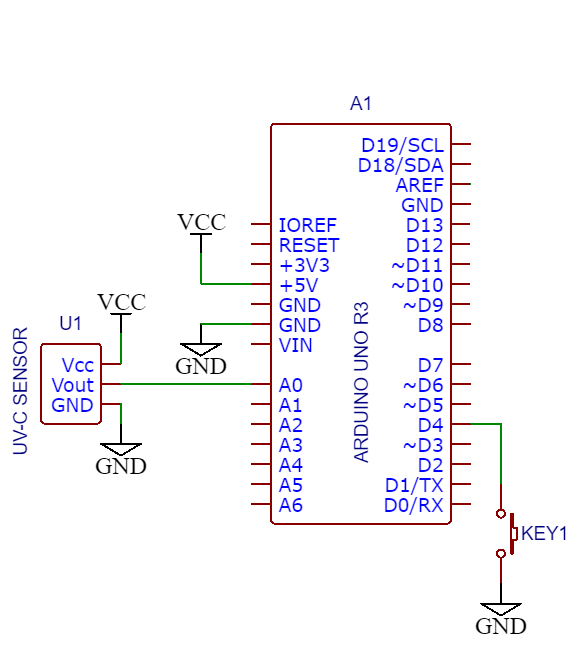
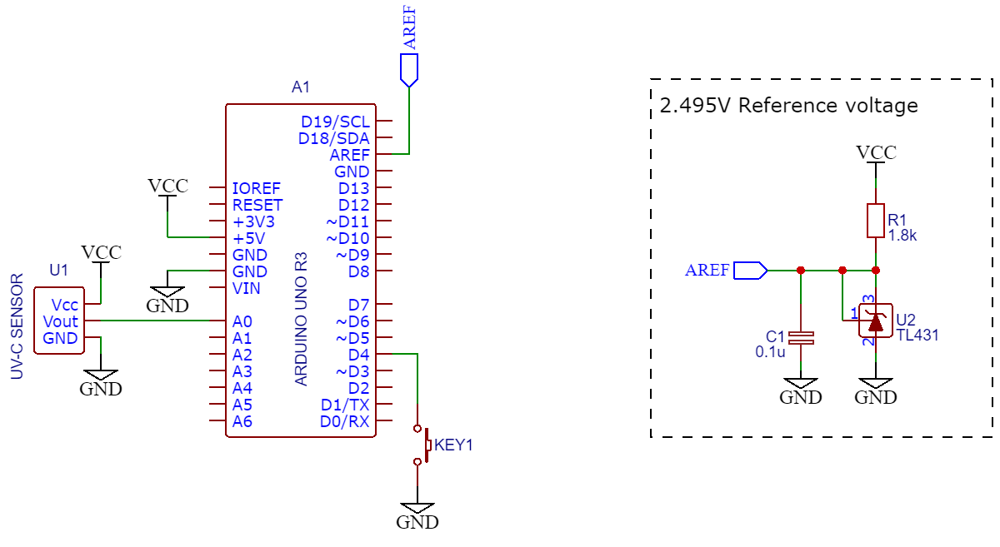
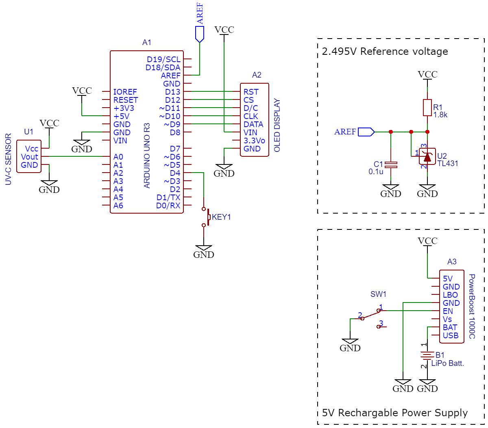
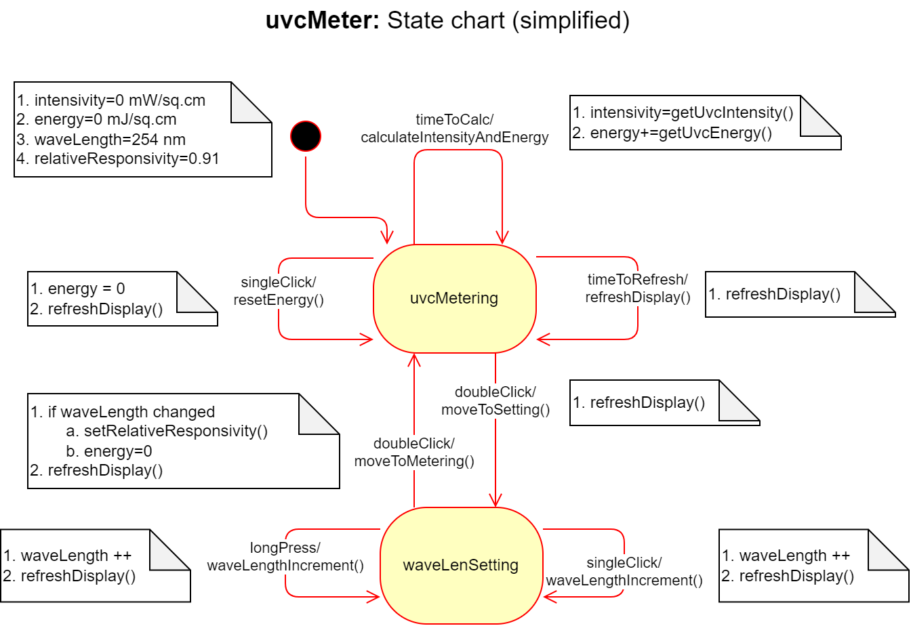

# uvcMeter
Intensity and energy meter of ultraviolet c-band (UVC) radiations


> _Let's turn the Arduino board into precise ultraviolet c-band radiation's intensity and energy meter!_

During the COVID-19 pandemic we were able to wear face masks, gloves, keeping social distances, periodically sanitizing our hands and everything we touch. Despite all this, the pandemic shown us how vulnerable we are when we are infected through our smartphones as we touch things and not always have possibility to disinfect smartphones before we touch them again. There wasn't an efficient and practical means to keep our smartphones virus-safe except using the UVC disinfectors that inactivate the virus.

Dishonest sellers around the world took advantage of the situation and sold many fake UVC disinfectors that emit ultraviolet lights (as our eyes see), but not necessarily radiating the ultraviolet lights in the germicidal range, so called C-rays, within the wavelength from 200 nm to 280 nm [1]. I myself became a victim of such "UVC disinfecting bulbs", and not once.

UVC meters sold by Amazon range between 100 and 300 USD (3+ stars); some "exotic" UVC meters exceed 600 USD. Hence, I started pondering how we could device ourselves one for affordable cost.

Below I describe various hardware configurations of UVC meter that will cost you, apart from your Arduino Uno board, a 20 USD UV sensor module, and any generic push button that lays around. This is the minimum hardware you can start with. Depending on your needs and requirements, you can add some other parts and modules into your breadboard that will improve the accuracy, autonomy and functionality of the UVC sensor (refer to [Circuits section](URL here**)) below.

# Circuits

## Hardware configuration #1

This configuration requires the Arduino Uno, the UV sensor module and any generic push button (refer to below schematic and [BOM section](URL here**)).



**Functionality**
- [x] Measures UVC radiations' intensity and energy;
- [x] Possibility of setting the UVC radiation's wavelength;
- [x] Displays the measurements through computer's serial port.

**Limitations**
- Measurement accuracy depends on the stability of computer's USB voltage;
- UVC meter can only be used with the computer

## Hardware configuration #2

The limitations with the measurement accuracy of the  can be resolved if we are able to "feed" the ADC conversion with stable and accurate reference voltage. This configuration attempts to solve the limitation with use of widely available generic Precision Programmable Reference with couple of widely available generic components (refer to below schematic and [BOM section](URL here)).



**Functionality**
- [x] Accurately measures UVC radiations' intensity and energy;
- [x] Possibility of setting the UVC radiation's wavelength;
- [x] Displays the measurements through computer's serial port.

**Limitations**
- UVC meter can only be used with the computer

## Hardware configuration #3

If you need a stand-alone UVC meter that is not connected to a computer, with a recharging function, then you might go with this configuration. It has own small display, powered by a Lithium battery that you can recharge any time needed.



**Functionality**
- [x] Accurately measures UVC radiations' intensity and energy;
- [x] Possibility of setting the UVC radiation's wavelength;
- [x] Built-in small OLED display;
- [x] Rechargeable battery with charging and cut-off circuits.

**Limitations**
- a little bulky (•_•)

## BOM

Name	| Dsgn |	Qty |	Mnf Part |	Mnf |	Supplier |	Sup. Part | C #1 | C #2 | C #3
:--- | :--- | :---: | :--- | :--- | :--- | :--- | :---: | :---: | :---:
Arduino Uno R3 | A1 | 1 | A000066 | Arduino | Digi-Key | 1050-1024-ND | &check; | &check; | &check;
OLED Display | A2 |		1 |	661 |	Adafruit Industries LLC |	Digi-Key |	661-ND | | | &check;
PowerBoost 1000C |	A3 |	1 |	2465 |	Adafruit Industries LLC | | | | | &check;
LiPo Batt.	| B1 | 1 | | | | | | | &check;
0.1u	| C1 | 1 | generic | | | | | &check; | &check;
Push button	| KEY1 | 1 | generic | | | | &check; | &check; | &check;
1.8k	| R1 | 1 | generic | | | | | &check; | &check;
Switch	| SW1 | 1 | generic | | | | | | &check;
UV-C Sensor	| U1 | 1 |	GUVC-T21GH |	Genicom Co., Ltd. |	Digi-Key |	2096-GUVC-T21GH-ND | &check; |	&check; |	&check;
TL431	| U2 | 1 | generic | | | | | &check; | &check;

# Software

## General description

In order to maintain good readability of the software as well as its future support/maintenance, it has been developed around the Finite State Machine (FSM). The FSM concept is well explained in [2] including the FSM code generator.



Detection of the events that uvcMeter's FSM has to react is done in the main loop() in a "pulling" style via used libraries' functions. Once any event occurs, appropriate FSM's "event" function is invoked. Then the FSM depending on its current state itself invokes relevant customized (by developer) transition function.

Resetting the energy counter and setting/changing the wavelength of the UVC radiation being measured are done through the control button. Functions of the control button:

1. In the Intensity/Energy measurement state:
- One click: reset the Energy counter;
- Double click: shift to UVC wavelength setting.
2. In the wavelength setting state:
- One click: wavelength is incremented by 1;
- Long press: wavelength is incremented quickly;
- Double click: shift to Intensity/Energy measurement.

## Configuration

Depending of the selected/assembled hardware [configuration](URL here), the "tuning" the software is pretty straight forward. You need to open commmon.h file and uncomment the line corresponding to your configuration.

``` C++
// HARDWARE CONFIGURATION OPTION
// Uncomment the option related to your circuit assembly

//#define HCONFIG       1           // Hardware Configuration #1
//#define HCONFIG       2           // Hardware Configuration #2
#define HCONFIG       3           // Hardware Configuration #3
```


## Software files

### uvcMeter.ino

This is the main Arduino sketch traditionally containing setup() and loop() functions. Apart from initializing variables to their default values, the project uses two libraries: Timer and OneButton. Timer library [3] is used in integration of UVC intensity by time to get UVC energy [4]. *Kindly note: Event library is part of Timer library, and it is installed automatically during Timer library installation*. OneButton library [5] is used to detect single and double clicks on the push button, as well as to detect the long press the button.

Both libraries have functions to attach event handlers that were used in the setup(). Apart from this the libraries require their appropriate "pulling" functions (i.e. update() and tick()) to be repeatedly called in the main loop().

As the events are detected in the "pulling" manner, it requires that the sensor's signal should be read with minimum delay. Hence, "read without blocking" solution proposed by Nick Gammon [6] was used to read the sensor's signal. Nick Gammon's suggestion for ADC conversion [6] was used in reading the sensor's output signal (refer to fsm_transition.cpp file).

### common.h

As the project contains many *.h and *.cpp files, the exchange of data/information between modules becomes a bit tedious. Hence this header file is there containing of all "extern" variable. Apart from this, the common.h file is used to select the hardware configuration (refer to [Configuration](URL here) section), and you can define the pins you used in the hardware assembly and time periods if default values need to change.

### fsm.h , fsm.cpp , fsm_transition.cpp

These files are related to uvcMeter's Finite State Machine. You do not need to modify fsm.h and fsm.cpp files unless you wish to change the State Machine (e.g. new states, new events etc.). In this case, I would suggest you to use the excel FSM generator first (refer to FSMGenerator.xls file included in the docs/res folder) and customize the functions in the fsm_transition.cpp file.

fsm_transition.cpp the file contains transition functions that FSM executes as a reaction to the events based on its current state and logic. These custom functions contain simple statements and mainly invoke other functions implemented in oled.cpp, sensor.cpp and sprint.cpp files as these are hardware-dependent and configuration-dependent functions. In assembling the circuits, you might have different hardware that are functionally similar. For them you may decide to develop your own functions.

### sensor.cpp , sensor.cpp

Contain functions that are specific to used sensor and its specification.

### oled.h , oled.cpp

Contain functions aimed to display the measurement data or wavelength. More information on used libraries, functions and examples can be found in [7].

### sprint.h , sprint.cpp

Arduino's famous `Serial.print()` function and little formatting! All this module does is just to print on the computer's serial. Nothing really much to describe!

## Folder structure

| lev 0 | lev 1 | lev 2 | Description |
| ---     | ---     | ---     | ---         |
| docs\     |       |         | folder      |
|         | pics\   |         | folder      |
|         |         |*.png    | images for README.md |
|         | etc\    |         | folder      |
|         |         | FSMGenerator.xls          | excel FSM generator|
|         |         | uvc_meter_FSM.drawio      | uvcMeter's FSM (diagrams.net file)     |
|         |         | uvcMeter_BOM.xlsx         | bill of materials     |
|         |         | uvcMeter_Schematic_v1.pdf | schematic of uvcMeter |
|         |         | uvcMeter_Schematic_v1.png | schematic of uvcMeter |
| src\ |       |         | `uvcMeter.ino` sketch and other `*.h` and `*.cpp` files of this project |
| LICENSE   |       |         | MIT license text |
| README.md |       |         | this document |


# References

[1] International Ultraviolet Association. _International Ultraviolet Association Inc - UV Disinfection for COVID-19_ [Online]. Available: https://www.iuva.org/IUVA-Fact-Sheet-on-UV-Disinfection-for-COVID-19

[2] M. Lueders, S. Schauer, "Application Report. Finite State Machines for MSP430", Texas Instruments, SLAA402A, 2009

[3] J. Christensen. *JChristensen/Timer: A fork of Simon Monk's Arduino Timer library* [Online]. Available: https://github.com/JChristensen/Timer

[4] Shenzhen Linshang Technology Co., Ltd. (2019, Oct. 21). *UV Light Intensity Units and Units Conversion* [Online]. Available: https://www.linshangtech.com/tech/tech508.html

[5] M. Hertel. *mathertel/OneButton: An Arduino library for using a single button for multiple purpose input* [Online]. Available: https://github.com/mathertel/OneButton

[6] N. Gammon. (2015, Feb. 27). *Gammon Forum : Electronics : Microprocessors : ADC conversion on the Arduino (analogRead)* [Online]. Available: https://www.gammon.com.au/adc

[7] Adafruit Industries LLC. (2022, Oct. 17). *Arduino Library & Examples | Monochrome OLED Breakouts | Adafruit Learning System* [Online]. Available: https://learn.adafruit.com/monochrome-oled-breakouts/arduino-library-and-examples
